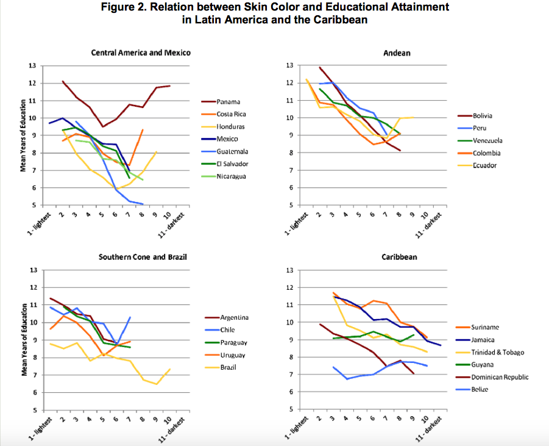
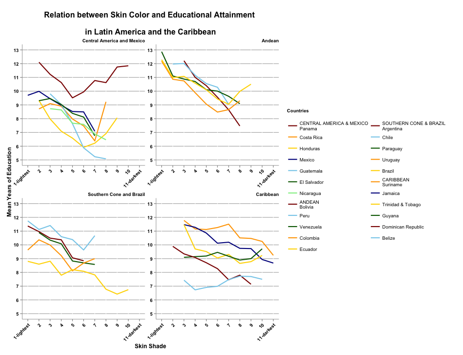
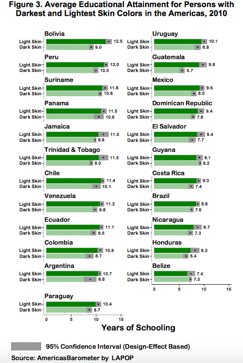
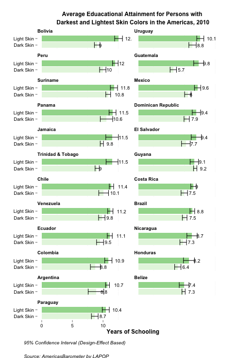
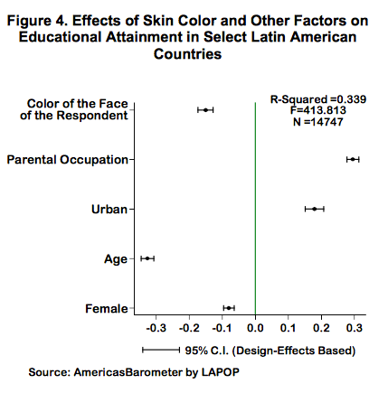
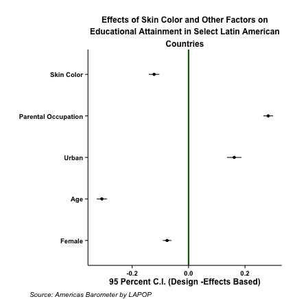

--- 
title: "RepProj_Megan_Kalyani"
author: "Megan and Kalyani"
date: "March 15, 2015"
output: html_document
---

**Replicated Paper:**

Pigmentocracy in the Americas: How is Educational Attainment Related to Skin Color?
By Edward Telles and Liza Steele

**Abstract:**

This paper addresses the question of whether educational attainment, a key indicator of socioeconomic status, is related to skin color in Latin America and the Caribbean. Based on data from the 2010 AmericasBarometer, our analysis shows that persons with lighter skin color tend to have higher levels of schooling than those with dark skin color throughout the region, with few exceptions. Moreover, these differences are statistically significant in most cases and, as we show in a test of several multiracial countries, the negative relation between skin color and educational attainment occurs independently of class origin and other variables known to affect socioeconomic status. Thus, we find that skin color, a central measure of race, is an important source of social stratification throughout the Americas today. (2012:i)

**Figure 1 in the paper is an image to aid with the understanding of a variable(colorr):**

.png)

(There is nothing to replicate)

**Here is the set up for Figure 2 by Telles and Steele:**

In Figure 2, we show the relation between skin color and schooling for 23 countries in the 2010 AmericasBarometer.4 Our dependent variable is educational attainment, which is based on the grade level completed by the respondent. 

Figure 2 graphically represents the relation between educational attainment and skin color in four regions, where the lightest persons are near 1 and the darkest near 11. We present data points only where there are at least 30 persons from the survey. Categories with fewer than 30 respondents are combined with contiguous groups (for example, 1’s are combined with 2’s in many countries, in which case the combined category is reported as a 2) (2012:2)

**Here is the figure from the paper:**



**Here is our replication:** 



**Here is our code:** 

```{r message=FALSE}
#####################################################################################################################
#####   Assignment: Replication Project (Part 1)                                                                #####
#####   Due Date:   3/15/2015                                                                                   #####
#####   Authors:    Megan Blanchard and Kalyani Jayasankar                                                      #####
#####   Input:      clean2010data.dta, colorr_recode_subset.dta, and Images in Images folder of project         #####
#####   Output:     This code does anaylsis on the clean data file. We create 4 figures :                       #####
#####               Figure 2: Relation between Skin Color and Educational Attainment                            #####
#####               Figure 3: Bar Graph of Average Ed by Skin Color for each country                            #####
#####               Appendix: OLS Models Predicting Years of Schooling in Latin American Countries, 2010        #####
#####               Figure 4: Effects of Skin Color and Other Factors on Educational Attainment                 #####
#####################################################################################################################
library(survey)
library(foreign)
library(ggplot2)
library(gridExtra)
library(xtable)
library(dplyr)

clean.2010 <-read.dta("clean2010data.dta")
colorr_recode_subset <- read.dta("colorr_recode_subset.dta")
```


```{r message=FALSE}
####################################################################################################################
##### Creating Figure 2: Relation between Skin Color and Educational Attainment in Latin America and the Caribbean
##### facet by the four specified regions
####################################################################################################################

#figure 2 prep, calculate mean ed for figure 2
mean_ed_graph <- colorr_recode_subset %>%
  select(colorr_recode, pais, region, ed, weight1500) %>%
  filter(!is.na(ed)) %>%
  group_by(colorr_recode, pais, region) %>%
  summarize(mean_ed = weighted.mean(ed, weight1500)) 
  
#oder regions for figure
mean_ed_graph$region <- factor(mean_ed_graph$region, 
                        levels = c("Central America and Mexico", 
                                   "Andean", 
                                   "Southern Cone and Brazil", 
                                   "Caribbean"))
#order countries 
mean_ed_graph$pais <- factor(mean_ed_graph$pais,
                  levels = c("Panama", "Costa Rica", "Honduras",  "Mexico", "Guatemala", "El Salvador", "Nicaragua", 
                           "Bolivia", "Peru", "Venezuela", "Colombia", "Ecuador",
                           "Argentina", "Chile", "Paraguay", "Uruguay",  "Brazil", 
                           "Suriname", "Jamaica", "Trinidad & Tobago",  "Guyana", "Dominican Republic", "Belize"))

#figure 2
p <- ggplot(data = mean_ed_graph, aes(x = colorr_recode, y = mean_ed, color = pais))
fig2 <- p + layer (geom="line", size = 1) +
  facet_wrap(~region, scales = "free") +
  scale_color_manual("Countries, by Region\n",
                     labels = c("CENTRAL AMERICA & MEXICO\nPanama", 
                                "Costa Rica", "Honduras",  "Mexico", "Guatemala", "El Salvador", "Nicaragua", 
                                "ANDEAN\nBolivia", 
                                "Peru", "Venezuela", "Colombia", "Ecuador",
                                "SOUTHERN CONE & BRAZIL\nArgentina", 
                                "Chile", "Paraguay", "Uruguay",  "Brazil", 
                                "CARIBBEAN\nSuriname", 
                                "Jamaica", "Trinidad & Tobago",  "Guyana", "Dominican Republic", "Belize"),
                     values = c("dark red", "orange", "gold", "dark blue", "sky blue", "dark green", "light green",
                                "dark red", "sky blue", "dark green", "orange", "gold",
                                "dark red", "sky blue", "dark green", "orange", "gold", 
                                "orange", "dark blue", "gold", "dark green", "dark red", "sky blue")) +
  xlab("Skin Shade") + 
  ylab("Mean Years of Education") +
  scale_y_continuous(limits = c(5,13), breaks = (5:13)) +
  scale_x_continuous(limits = c(1,11), breaks = (1:11), 
      labels = c("1-lightest", "2", "3", "4", "5", "6", "7", "8", "9", "10", "11-darkest")) +
  ggtitle("Relation between Skin Color and Educational Attainment 
          \n\nin Latin America and the Caribbean") +
  theme(plot.title = element_text(lineheight =.6, face = "bold", size = 16),
      strip.text.x = element_text(face = "bold", hjust = 1), 
      strip.background = element_rect(colour = "white", fill = "white"), 
      panel.background = element_rect(fill = 'white', colour = 'white'),
      axis.text.x = element_text(colour = "black", face = "bold", 
        angle = 45, hjust = 1),
      axis.text.y = element_text(colour = "black", face = "bold"), 
      axis.title = element_text(face = "bold"),
      panel.grid.minor = element_blank(),
      panel.grid.major.y = element_line(colour = "dark gray", linetype = 1) ,
      axis.line = element_line(colour = "dark gray"), 
      legend.key = element_rect(fill = "white", color = "white")) +
  guides(col = guide_legend(ncol = 2))

```

**Here is the set up for Figure 3 by Telles and Steele:**

Figure 3 shows the mean levels of schooling for the residents with the lightest skin (1-3) compared to those with darkest skin (6+) in all 23 countries, ordered by the size of the average difference between the two. Figure 3 also presents confidence intervals around these means, given that there is a margin of error for these population samples, as there is in all survey samples of large populations (2012:4)

**Here is the figure from the paper:**



**Here is our replication:**



**Here is our code:**

```{r message=FALSE}
####################################################################################################################
#####shows the mean levels of schooling for the residents with the lightest skin (1-3) 
#####compared to those with darkest skin (6+) in all 23 countries, 
#####ordered by the size of the average difference between the two. 
####################################################################################################################

#prep for Figure 3, create a new dataframe pais_ed
pais_ed <- colorr_recode_subset %>%
  filter(!is.na(colorr_recode), !is.na(ed), tone != "medium") %>%
  group_by(pais, tone) %>%
  select(pais, tone, ed, weight1500) %>%
  mutate(se = sd(ed)/sqrt(length(ed)), 
         ed_n = length(ed), 
         ci.lower = (weighted.mean(ed, weight1500) - 1 * qt(.975, (ed_n - 1)) * se), 
         ci.upper = (weighted.mean(ed, weight1500) + 1 * qt(.975, (ed_n - 1)) * se)) %>%
  group_by(pais, tone, ci.lower, ci.upper) %>%
  summarise(mean_ed = weighted.mean(ed, weight1500))

#fig 3 prep, order countries 
pais_ed$pais <- factor(pais_ed$pais,
                levels = c("Bolivia", "Uruguay", "Peru", "Guatemala", "Suriname", 
                           "Mexico", "Panama", "Dominican Republic", "Jamaica",  
                           "El Salvador", "Trinidad & Tobago", "Guyana", "Chile", 
                           "Costa Rica", "Venezuela", "Brazil", "Ecuador",  "Nicaragua", 
                           "Colombia", "Honduras", "Argentina", "Belize", "Paraguay"))

#Figure 3
fig3 <- ggplot(pais_ed, aes( x = factor(tone), y = mean_ed, fill = tone)) +
  ylim(0, 14) +
  ylab("Years of Schooling") + xlab("") +
  geom_bar(stat ="identity") + 
  geom_errorbar(aes(ymin = ci.lower, ymax = ci.upper)) + 
  facet_wrap(~ pais, ncol = 2) + coord_flip() +
  geom_text(aes(label = round(mean_ed, 1)), size = 3.5, hjust = -.7) +
  scale_fill_brewer(palette = "Greens") +
  theme(legend.position = "none") +
  scale_x_discrete(labels = c("Dark Skin", "Light Skin")) +
  ggtitle("Average Eduacational Attainment for Persons with \n \nDarkest and Lightest Skin Colors in the Americas, 2010") +
  theme(plot.title = element_text(lineheight =.6, face = "bold", size = 12),
        strip.text.x = element_text(face = "bold", hjust = 0), 
        strip.background = element_rect(colour ="white", fill ="white"), 
        panel.background = element_rect(fill = 'white', colour = 'white'),
        axis.text = element_text(colour = "black"), 
        axis.title = element_text(face = "bold")) 

fig3.note <- arrangeGrob(fig3, 
                         sub = textGrob("95% Confidence Interval (Design-Effect Based) 
                                        \nSource: AmericasBarometer by LAPOP",
                                        x = .1, hjust = 0, vjust = .5,
                                        gp = gpar(fontface = "italic", fontsize = 10)))

````

**Here is the set up for Figure 4 by Telles and Steele:**

Since other factors besides color may affect years of schooling, we run a regression analysis predicting years of education by skin color, as well as class origin, age, sex, urban/rural residence and country of residence. We run the regression model only for the eight countries (Bolivia, Brazil, Colombia, Dominican Republic, Ecuador, Guatemala, Mexico and Peru) in which the class origin data are available[…] The results of the OLS regression analysis are are summarized graphically in Figure 4. In order to compare the relative sizes of the effects, the figure presents standardised coefficients (2012:5)

**Here is the Figure 4 from the paper:**



**Here is our replication:** 



**Here is our code:** 

```{r message=FALSE}
####################################################################################################################
#####And Figure 4. Effects of Skin Color and Other Factors on Educational Attainment 
####################################################################################################################

#prep, select correct countries for analysis in new data frame, make categorical vars numeric
eight_pais <- colorr_recode_subset %>%
  filter(pais %in% c("Brazil", "Mexico", "Guatemala", "Colombia", 
                     "Ecuador", "Bolivia", "Peru", "Dominican Republic")) %>%
   filter(!is.na(pais), !is.na(ed), !is.na(q2), !is.na(q1), 
          !is.na(parent_occ), !is.na(ur), !is.na(colorr)) %>%
   mutate(ed = as.numeric(ed),
         parent_occ = as.numeric(parent_occ),
         age = as.numeric(q2), 
         Female = ifelse(q1 == "Female", 1, ifelse(q1 == "Male", 0, NA)), 
         Urban = ifelse(ur == "Urban", 1, ifelse(ur == "Rural", 0, NA)),
         Brazil = ifelse(pais == "Brazil", 1, 0),
         Mexico = ifelse(pais == "Mexico", 1, 0),
         Guatemala = ifelse(pais == "Guatemala", 1, 0),
         Colombia = ifelse(pais == "Colombia", 1, 0),
         Ecuador = ifelse(pais == "Ecuador", 1, 0),
         Bolivia = ifelse(pais == "Bolivia", 1, 0),
         Peru = ifelse(pais == "Peru", 1, 0),
         Dominican_Republic = ifelse(pais == "Dominican Republic", 1, 0))

#model 1
svy<- svydesign(ids=~upm, strata=~ estratopri, data=eight_pais, weights=~weight1500, nest=TRUE)
model1.graph <- svyglm(scale(ed) ~ scale(colorr) + 
                               scale(parent_occ) + 
                               scale(Urban) + 
                               scale(q2) + 
                               scale(Female) + 
                               scale(Mexico) + 
                               scale(Guatemala) + 
                               scale(Colombia) + 
                               scale(Ecuador) + 
                               scale(Bolivia) + 
                               scale(Peru) + 
                               scale(Dominican_Republic), svy)
                              
#creating data frame of coefficients and CI's
graph.coef <- summary(model1.graph)$coefficients[2:6, 1]
model1.CI <- confint(model1.graph)
model1.CIlower <- model1.CI[2:6 , 1]
model1.CIupper <- model1.CI[2:6 , 2]

labels = c("Skin Color","Parental Occupation", "Urban", "Age", "Female")

frame <- data.frame(variable = labels,
                    coefficient = graph.coef,
                    ci.lower = model1.CIlower,
                    ci.upper = model1.CIupper)

#reorder variables
frame$variable.order <- factor(frame$variable, levels = c("Female", "Age", "Urban", "Parental Occupation", "Skin Color"))


#Create Figure 4
fig4<- ggplot(frame, aes(y = coefficient, x = variable.order)) + geom_point() +
  geom_pointrange(aes(ymin = ci.lower,  ymax = ci.upper)) +
  geom_hline(yintercept = 0, color ="dark green", size = 1) +
  coord_flip() +
  ylab("95 Percent C.I. (Design -Effects Based)") + xlab("") +
  theme_classic() +
  ggtitle("Effects of Skin Color and Other Factors on\n\n Educational Attainment in Select Latin American \n\nCountries") +
  theme(plot.title = element_text(lineheight =.6, face ="bold", size = 12),
        axis.text = element_text(colour = "black", face = "bold"), 
        axis.title = element_text(face = "bold"))

fig4.note <- arrangeGrob(fig4, 
                         sub = textGrob("Source: Americas Barometer by LAPOP",
                                        x = .1, hjust = 0, vjust = 0,
                                        gp = gpar(fontface = "italic", fontsize = 10)))

```


